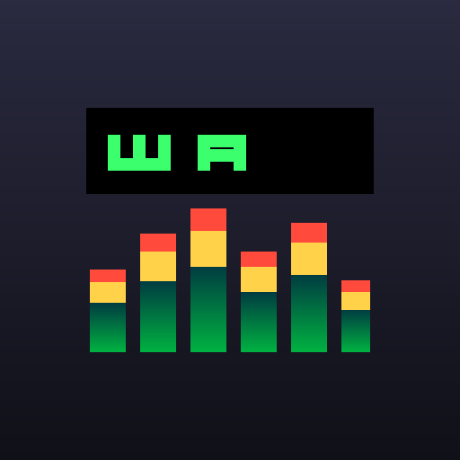

# 🦙 Winamp Mobile

A loving recreation of the **classic Winamp** player, rebuilt as a mobile-first,
installable **Progressive Web App**. It really whips the llama's ass.



## Features

- **🎵 Plays your local audio** — MP3, OGG, WAV, M4A, AAC, FLAC, Opus. Files never
  leave your device; everything plays locally via the Web Audio API.
- **📊 Classic visualizations** — the iconic 19-band spectrum analyzer with
  peak-hold, plus an oscilloscope mode. Tap **VIS** to cycle.
- **🎚️ 10-band graphic equalizer** — real biquad-filter EQ with a preamp and
  9 presets (Rock, Pop, Jazz, Dance, Bass Boost, and more).
- **📃 Playlist editor** — add files, reorder-free tap-to-play, per-track remove,
  shuffle and repeat (none / all / one).
- **🎛️ Authentic skin** — beveled buttons, green LCD time display, scrolling
  track marquee, volume & balance sliders, seek bar.
- **📱 Installable & offline** — add to your home screen; the app shell is cached
  by a service worker and runs without a network connection.
- **🔒 Lock-screen controls** — Media Session integration for play/pause/next/prev.
- **⌨️ Keyboard shortcuts** (desktop): `Space`/`x` play-pause, `b`/→ next,
  `z`/← previous, `v` stop.

## Try it without any files

Tap **+ DEMO** in the playlist to load three synthesized chiptune demo tracks —
generated entirely in-browser, no downloads required.

## 🎨 Real Winamp skin support (`.wsz`)

Winamp Mobile reads **actual classic Winamp 2.x skins**. Tap **LOAD .WSZ SKIN**
(or drag a `.wsz` onto the window) and the player repaints itself with that
skin's graphics.

A `.wsz` file is just a ZIP of bitmap sprite sheets. The app parses it entirely
in-browser (`js/wsz.js`, using the native `DecompressionStream` — no
dependencies) and maps each sprite to the classic 275×116 main-window layout
(`js/skin.js`):

| Skin file | Used for |
|-----------|----------|
| `main.bmp` | main window background |
| `titlebar.bmp` | title bar |
| `cbuttons.bmp` | play / pause / stop / prev / next / eject (with pressed states) |
| `shufrep.bmp` | shuffle / repeat / EQ / playlist buttons |
| `numbers.bmp` / `nums_ex.bmp` | the LCD time digits |
| `text.bmp` | the scrolling track-title bitmap font |
| `posbar.bmp`, `volume.bmp`, `balance.bmp` | slider thumbs & tracks |
| `viscolor.txt` | the spectrum-analyzer color palette |
| `pledit.txt` | playlist text/background colors |

Where to get skins: the [Winamp Skin Museum](https://skins.webamp.org) has
thousands of free `.wsz` files — download one and load it.

> **Coverage:** the **main window** is rendered pixel-for-pixel from the skin.
> The equalizer and playlist windows keep the app's own layout but adopt the
> skin's `viscolor`/`pledit` palette. Tap **↩ MODERN UI** to return to the
> default look.

## Run as a web app

```bash
npm start          # serves at http://localhost:8080
```

Then open the URL on your phone (same network) or in a mobile-emulated browser,
and **Add to Home Screen** to install it as a standalone app.

> A secure context (`https://` or `localhost`) is required for the service
> worker and audio graph. The bundled dev server uses `localhost`, which counts.

## Build the Android APK

The `android/` directory wraps the web app in a native WebView shell
(`WebViewAssetLoader` serves it over a virtual `https://` origin so ES modules,
the service worker, and Web Audio all work). The web app is the single source of
truth — a Gradle task bundles it into the APK at build time, so there's nothing
to keep in sync.

```bash
cd android
export ANDROID_HOME=/path/to/android-sdk      # needs platform 34 + build-tools 34
gradle :app:assembleDebug                      # or ./gradlew if you add a wrapper
# → app/build/outputs/apk/debug/app-debug.apk
```

Install on a device: `adb install app/build/outputs/apk/debug/app-debug.apk`.

The native shell forwards the in-page file pickers to Android's document
chooser, so **EJECT / + ADD** pick audio files and **LOAD .WSZ SKIN** picks skin
archives straight from device storage.

## Project structure

```
index.html              App shell & layout
css/winamp.css          The classic Winamp skin
js/app.js               Main controller wiring UI ↔ modules
js/player.js            Web Audio engine (gain, balance, EQ chain, analyser)
js/visualizer.js        Spectrum analyzer & oscilloscope canvas renderer
js/equalizer.js         10-band EQ UI + presets
js/playlist.js          Playlist model, shuffle/repeat, rendering
js/demo.js              In-browser WAV demo-track synthesizer
sw.js                   Service worker (offline app shell)
manifest.webmanifest    PWA manifest
server.mjs              Zero-dependency static dev server
```

## How the audio graph works

```
<audio> ─▶ MediaElementSource ─▶ preamp ─▶ EQ[0..9] (biquad) ─▶ stereo pan
        ─▶ master gain ─▶ analyser ─▶ destination (speakers)
```

The `AnalyserNode` feeds the visualizer; the biquad chain implements the
graphic EQ; balance uses a `StereoPannerNode`.

## License

MIT — for educational / nostalgia purposes. Winamp is a trademark of its
respective owners; this is an independent fan recreation, not affiliated with
or endorsed by them.
